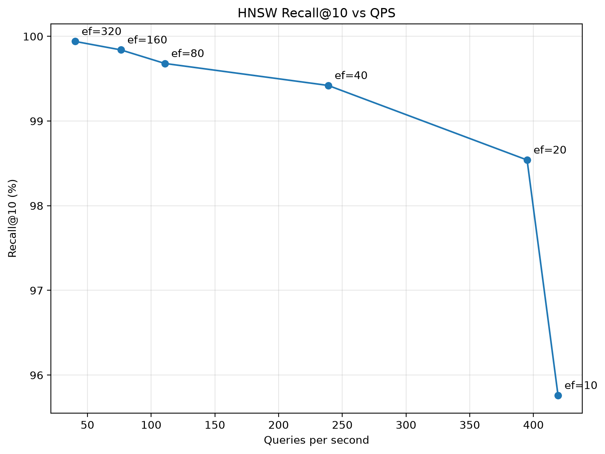
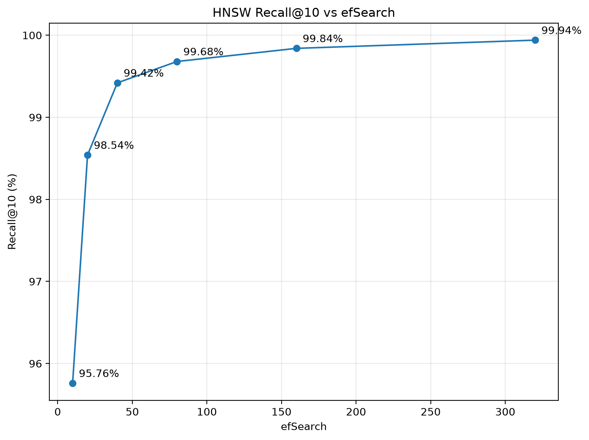

# chitlangia-vedant/vector-db

A vector database written entirely in Python and NumPy. The core search
implementation does not depend on FAISS, Chroma, or other high-level vector
search libraries.
## Interactive Search Demo

[Interactive CLI Execution GIF Placeholder]

```text
$ python scripts/demo.py
Loading embedding model...
Creating embeddings...

Indexed 15 statements.
Type a statement to find the closest matches.
Type 'exit' to quit.

Query: How are scientists using AI to detect illnesses?

Best matches:
1. Researchers developed an artificial intelligence system for detecting diseases.
   distance: 0.2058
2. Scientists are studying climate change and its effects on global temperatures.
   distance: 0.7597
3. Engineers designed a faster processor for next-generation computers.
   distance: 0.8473
```

## Core Architecture

This repository implements two search indexes directly in NumPy.

### Exact Search Index
The `FlatIndex` class performs exhaustive distance calculations across the entire vector space. It guarantees exact nearest neighbor retrieval. This index provides the absolute ground truth for evaluating the accuracy of the approximate search.

### Approximate Search Index
The `HNSW` (Hierarchical Navigable Small World) class implements approximate nearest neighbor search using a multi-layered graph. It supports vector insertion, search, and deletion.

```text
Layer 2:                  [A]
                          |
Layer 1:          [B] --- [A] --- [C]
                   |       |       |
Layer 0:    [D]---[B]---[E]---[A]---[C]---[F]
             \     |     |     |     /
              [G]--+-----+-----+---[H]
```

Upper layers provide long-range routing. Layer 0 contains the broader graph used to identify the final nearest neighbors.

### Vector Deletion
Deletion uses tombstones. When a node is deleted, its ID is added to the deleted-node set. Deleted nodes are excluded from search results but remain in the graph so that their existing connections can still participate in traversal. This avoids expensive graph rewiring during every deletion. The `rebuild()` operation creates a new HNSW graph containing only live nodes.

### Cosine Distance Calculation

For cosine search, vectors are L2-normalized before indexing and the query is
normalized before search. Therefore cosine similarity reduces to the dot product:

$d(u, v) = 1.0 - (u \cdot v)$

The implementation computes cosine distance using a dot product without
repeatedly calculating vector norms during search.

### Layer Assignment
HNSW assigns each node a random maximum level using an exponentially decreasing distribution. The distribution parameter is:

$m_L = 1 / \ln(M)$

M is the maximum number of graph neighbors configured for a node. For a random value U in (0, 1], the implementation samples:

$\text{level} = \lfloor-\ln(U) \times m_L\rfloor$

## Benchmark Results

### Dataset Configuration

| Parameter | Value |
| :--- | :--- |
| Corpus | AG News |
| Model | `all-mpnet-base-v2` |
| Dimensions | 768 |
| Normalization | L2 |
| Indexed Vectors | 50,000 |
| Query Vectors | 500 |

### Build Time and Index Size

The from-scratch implementation builds the graph in Python. Its insertion process performs graph traversal and neighbor selection for every vector, which makes construction slower than FAISS's optimized native implementation. The measured index size for our HNSW includes the stored float32 vectors and graph data.

| Engine | Build time | Index size |
| :--- | :--- | :--- |
| Ours HNSW | 3693.7 s | 160.5 MB |
| FAISS HNSW | 29.48 s | n/a |

### Exact Search Baseline

The exact baseline scans every indexed vector for every query. It is used as the ground truth for recall. The exact search is guaranteed to return the true nearest neighbors, so its recall is 1.0000 by definition.

| Engine | Recall@10 | p50 ms | p95 ms | QPS |
| :--- | :--- | :--- | :--- | :--- |
| Ours FlatIndex | 1.0000 | 118.42 | 133.37 | 8 |
| FAISS Flat | 1.0000 | 42.707 | n/a | 23 |

### HNSW Speed Versus Accuracy

Approximate search requires balancing how fast a query runs against how perfectly it matches the exact ground truth. The `efSearch` parameter controls this tradeoff.

Think of `efSearch` as the size of a search party exploring a city map. A small search party finishes quickly but might miss the best destination because they only checked a few paths. A large search party checks almost every path, ensuring they find the absolute best destination, but the coordination takes longer.

Increasing `efSearch` expands the dynamic list of candidate nodes evaluated during graph traversal. This buys higher recall accuracy at the cost of queries per second (QPS). The benchmark demonstrates the expected HNSW tradeoff.





**Our HNSW**

| efSearch | Recall@10 | p50 ms | p95 ms | QPS |
| :--- | :--- | :--- | :--- | :--- |
| 10 | 0.9576 | 2.264 | 3.639 | 419 |
| 20 | 0.9854 | 2.378 | 3.702 | 395 |
| 40 | 0.9942 | 3.990 | 5.918 | 239 |
| 80 | 0.9968 | 7.518 | 22.521 | 111 |
| 160 | 0.9984 | 12.713 | 18.502 | 76 |
| 320 | 0.9994 | 22.959 | 37.887 | 40 |

**FAISS HNSW Reference**

| efSearch | Recall@10 | p50 ms | p95 ms | QPS |
| :--- | :--- | :--- | :--- | :--- |
| 10 | 0.9368 | 0.130 | 0.195 | 6499 |
| 20 | 0.9770 | 0.186 | 0.270 | 5190 |
| 40 | 0.9922 | 0.322 | 0.465 | 3008 |
| 80 | 0.9968 | 0.550 | 0.773 | 1775 |
| 160 | 0.9982 | 1.003 | 1.447 | 982 |
| 320 | 0.9998 | 1.796 | 2.550 | 544 |

## Transparency and Mocking Scope

The core HNSW index, exact search, insertion, deletion, distance calculations,
and persistence are implemented directly in Python and NumPy. The unit-test data is synthetic; random vectors and queries are generated with NumPy. The large-scale benchmark uses 50,500 real AG News texts embedded via `all-mpnet-base-v2`. Exact ground truth is computed by the project's brute-force `FlatIndex`. FAISS is executed solely as an external reference implementation.

## Installation

The project requires Python 3.8 or higher.

1. Clone the repository and navigate to the project directory:
```bash
git clone https://github.com/Chitlangia-Vedant/vector-db.git
cd vector-db
```

2. Create and activate a virtual environment:
```bash
python -m venv .venv
.\.venv\Scripts\Activate.ps1
```

3. Install the dependencies and the project in editable mode:
```bash
pip install --upgrade pip
pip install -e .
pip install pytest sentence-transformers
```

## Usage

Run the unit test suite to verify core operations:
```bash
pytest -q
```

Start the interactive semantic search prompt:
```bash
python scripts/demo.py
```

### Executing the Benchmark

The repository includes pre-computed embeddings located at `benchmarks/data/embeddings.npz`. Run the benchmark across multiple `efSearch` values to evaluate the system:

```bash
python benchmarks/run_benchmark.py --ef-values 10,20,40,80,160,320
```

Raw metrics export to `benchmarks/results/results.json`.

To completely regenerate the embeddings from the raw text corpus:

```bash
python benchmarks/generate_embeddings.py --limit 50500
python benchmarks/run_benchmark.py --ef-values 10,20,40,80,160,320
```

To reproduce the FAISS comparison column in the benchmark, install FAISS separately (`pip install faiss-cpu`) before executing `run_benchmark.py`.

### Dataset Configuration

| Parameter | Value |
| :--- | :--- |
| Corpus | AG News |
| Model | `all-mpnet-base-v2` |
| Dimensions | 768 |
| Normalization | L2 |
| Indexed Vectors | 50,000 |
| Query Vectors | 500 |

## Project Structure

* `benchmarks/`: Data, scripts, and results for exact versus approximate evaluation.
* `docs/ARCHITECTURE.md`: Detailed internal data structures and distance metric proofs.
* `docs/BENCHMARKS.md`: Extended timing profiles and memory footprint calculations.
* `scripts/`: Interactive demo files.
* `tests/`: Synthetic unit tests.